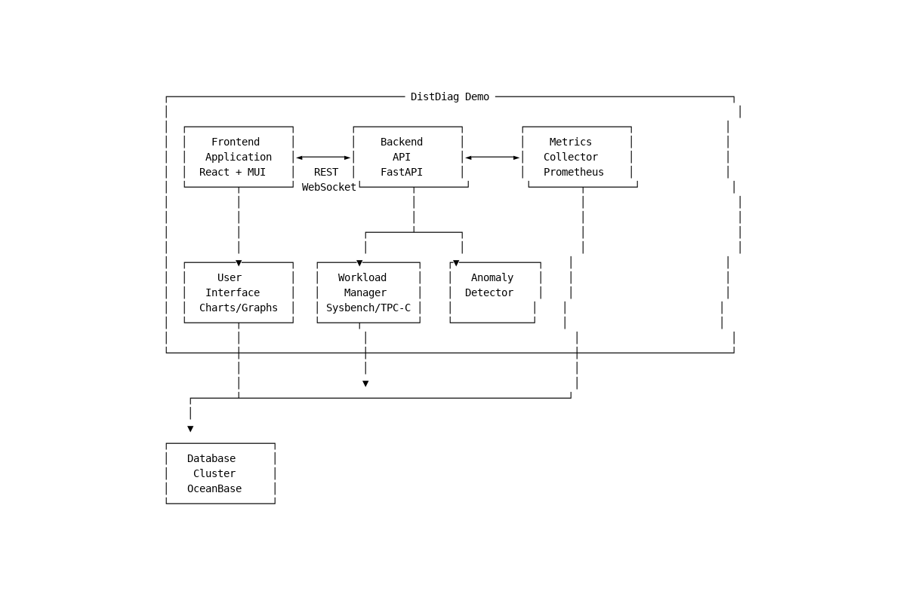

# DistDiag Demo

A comprehensive diagnostic and workload management system for distributed databases, featuring real-time monitoring, anomaly detection, and multi-workload support.

## Overview

DistDiag Demo is a full-stack application designed to help database administrators and developers diagnose performance issues and manage workloads in distributed database environments. It provides an intuitive web interface for running various database workloads (Sysbench, TPC-C, TPC-H) while monitoring system metrics and detecting anomalies in real-time.



## Features

### Workload Management
- Multiple workload types support:
  - Sysbench OLTP workloads
  - TPC-C (OLTP benchmark)
  - TPC-H (OLAP benchmark)
- Configurable workload parameters
- Real-time workload monitoring
- Automated database preparation

### Monitoring & Diagnostics
- Real-time system metrics visualization
- Resource usage monitoring (CPU, Memory, I/O)
- Performance metrics tracking
- Anomaly detection and alerts
- Root cause analysis

### User Interface
- Modern, responsive web interface
- Interactive charts and graphs
- Real-time updates
- Intuitive workload controls
- Dark/light theme support

## Project Structure

```
DistDiagDemo/
├── backend/              # FastAPI backend service
│   ├── app/             # Application code
│   ├── tests/           # Test cases
│   └── README.md        # Backend documentation
├── frontend/            # React frontend application
│   ├── src/            # Source code
│   ├── public/         # Static assets
│   └── README.md       # Frontend documentation
├── k8s/                # Kubernetes deployment files
│   ├── base/           # Base configurations
│   └── overlays/       # Environment-specific configs
├── docs/               # Documentation
└── README.md           # Main documentation
```

## Quick Start

### Prerequisites
- Python 3.8+
- Node.js 16+
- Docker and Docker Compose (optional)
- Access to a database cluster
- Sysbench, TPC-C, and TPC-H tools

### Installation

1. Clone the repository:
```bash
git clone https://github.com/yourusername/DistDiagDemo.git
cd DistDiagDemo
```

2. Set up the backend:
```bash
cd backend
pip install -r requirements.txt
# Set up workload tools (see backend/README.md for details)
```

3. Set up the frontend:
```bash
cd frontend
pnpm install
```

4. Configure environment variables:
```bash
# Backend (.env)
OB_HOST=your_db_host
OB_PORT=2881
OB_USER=root
OB_PASSWORD=your_password

# Frontend (.env)
VITE_API_URL=http://localhost:8000
```

### Running the Application

1. Start the backend:
```bash
cd backend
uvicorn app.main:app --reload --host 0.0.0.0 --port 8000
```

2. Start the frontend:
```bash
cd frontend
pnpm dev
```

3. Access the application at `http://localhost:5173`

## Documentation

- [Backend Documentation](backend/README.md)
- [Frontend Documentation](frontend/README.md)
- [API Documentation](http://localhost:8000/docs) (when backend is running)
- [Deployment Guide](docs/deployment.md)

## Development

### Backend Development
- FastAPI for REST API
- Pydantic for data validation
- SQLAlchemy for database operations
- Prometheus integration for metrics

### Frontend Development
- React with Vite
- Material-UI components
- Recharts for visualization
- Real-time updates with WebSocket

## License

MIT License - see the [LICENSE](LICENSE) file for details

## Acknowledgments

- [OceanBase](https://github.com/oceanbase/oceanbase) - The distributed database system
- [Sysbench](https://github.com/akopytov/sysbench) - Benchmark tool
- [TPC-C MySQL](https://github.com/Percona-Lab/tpcc-mysql) - TPC-C implementation
- [FastAPI](https://fastapi.tiangolo.com/) - Backend framework
- [React](https://reactjs.org/) - Frontend framework
